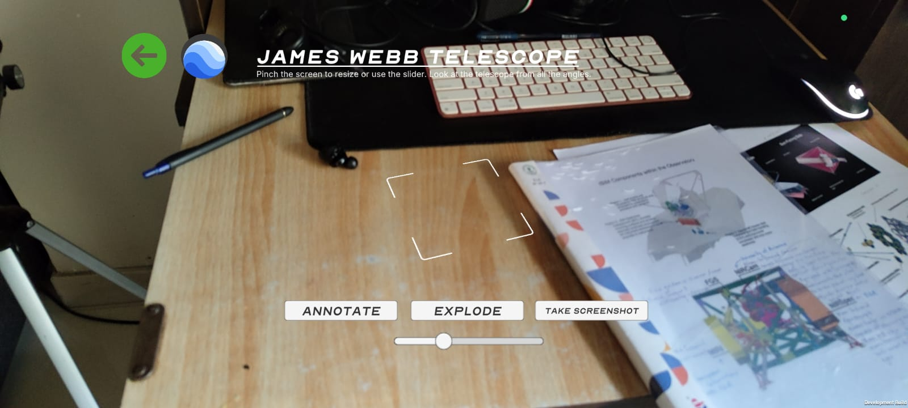
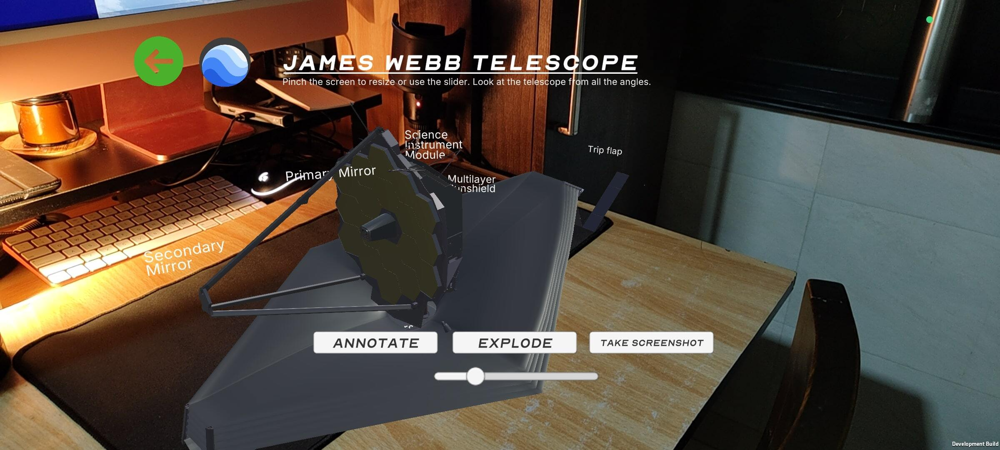
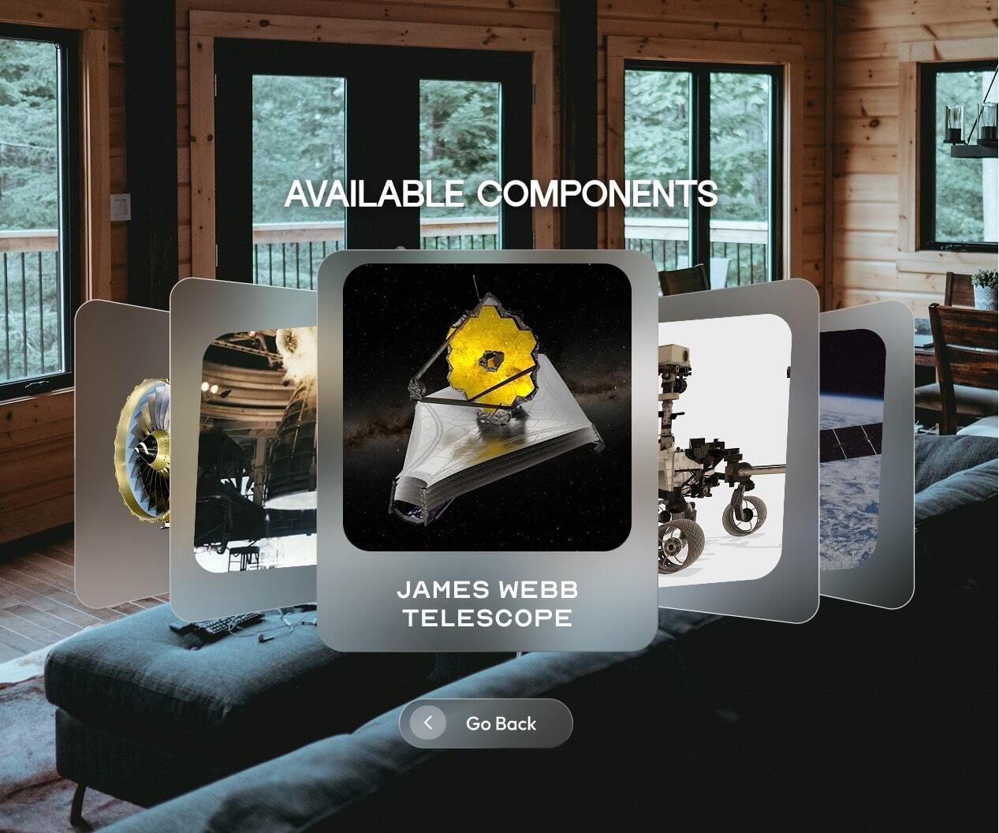
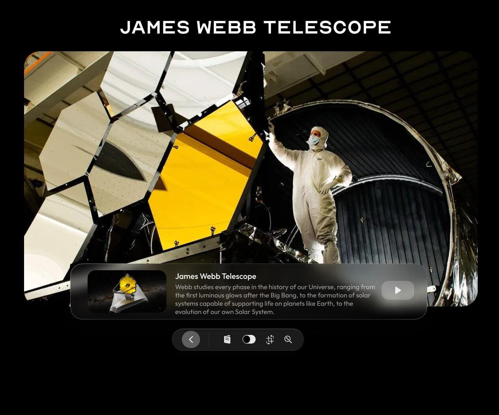
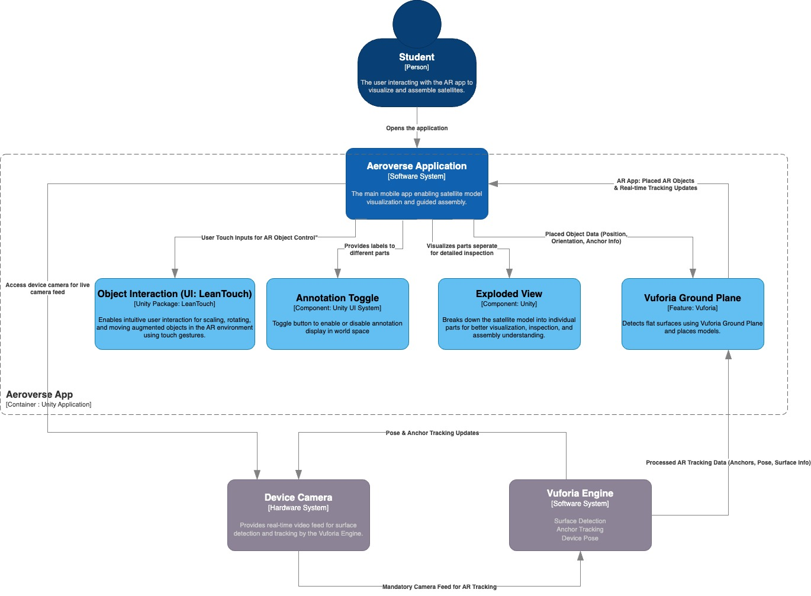

# AeroVerse XR - By Pixel Labs

This project brings the awe-inspiring **James Webb Space Telescope (JWST)** into your physical environment using **Augmented Reality (AR)**. Built in Unity and powered by **Vuforia's Ground Plane (markerless tracking)**, this experience allows users to explore the JWST model, toggle component-specific annotations, and interact with UI features like exploded view, rotation, resizing, and more.

## Logo

Now the best logo, but we think it's cool and we are happy :)


## Features

- **Markerless AR tracking** using Vuforia's Ground Plane.
- **Interactive annotations** that display detailed information for each part of the telescope.
- **Component-specific UI** with buttons for:
  - Exploded View
  - Rotate
  - Resize
  - Toggle Annotations
- **Main HUD UI** with:
  - Back to Main Menu
  - Learn More (Website Button)

## Demo

Explore AeroVerse XR in action:







[Sign Up] 

https://github.com/user-attachments/assets/6f4d14d9-b3cd-498a-bb67-d01f1b9642b7


[![Watch Augmentation Testing Video]


## Technologies Used

- **Unity (2022.x or later recommended)**
- **Vuforia Engine** for AR functionality
- **TextMeshPro** for annotation rendering
- **Unity UI Toolkit / uGUI** for main interface
- **C#** for logic and event handling

## Setup Instructions

### Prerequisites

- Unity Hub with a version that supports Vuforia (2022.3+ preferred)
- Android SDK (if building for Android)
- Vuforia Developer Account (for license key)

### Steps

1. **Clone this repository**

   ```bash
   git clone https://github.com/Chinmay-HS/AeroVerse-XR.githttps://github.com/your-username/jwst-ar-vuforia.git
   ```

2. **Open the project in Unity**

3. **Import Vuforia Engine**
   - Use Unity Package Manager or download from [Vuforia Developer Portal](https://developer.vuforia.com/).

4. **Insert your Vuforia License Key**
   - Go to `Vuforia Engine Configuration` in Unity and paste your license key.

5. **Assign your AR Camera**
   - Ensure your AR Camera is tagged as `MainCamera`.
   - Also assign this camera to the world-space canvases under the **Render Camera** field.

6. **Build Settings**
   - Platform: Android
   - Orientation: Landscape
   - Enable ARCore in Vuforia settings

## Working with Annotations

- Annotation labels are **world-space UI prefabs** that appear above specific parts of the telescope.
- These annotations face the camera and toggle on/off via a UI button.
- Annotations are created and linked using the `AnnotationManager.cs` script. 

The script automatically:
- Instantiates labels at attach points
- Makes them face the user
- Toggles them with a single button
- Displays console logs for debugging

## Known Issues

- On some Android devices, landscape UI may render in portrait mode if Auto-Rotation is not locked.
- World-space canvases require careful scaling and anchoring to appear properly in AR.

## Tips

- **Canvas Scaling:** Set your world-space canvas scale to `0.01` for AR readability.
- **Device Compatibility:** Ensure ARCore support is enabled in Project Settings.
- **Testing:** Test on a flat surface with proper lighting for optimal Vuforia plane detection.

## Asset Handling (Important)

To keep the repository size manageable:
- Large assets (textures, models) are either:
  - Excluded via `.gitignore`
  - Linked via cloud storage (see below)
  
If needed, download full assets from:
- [https://drive.google.com/drive/folders/1Aqz_G0siHe4rLvvdinogbyCsKXfnAqaN?usp=drive_link]

Add them to `Assets/HeavyAssets/` as mentioned in the documentation.

## Contribution

This project is still evolving. Feel free to:
- Fork it
- Add improvements (better animations, voice narration, etc.)
- Submit a pull request

## Acknowledgements

- NASA for JWST reference materials and design documentation
- Unity and Vuforia for the AR platform
- All contributors and testers involved in prototyping and field testing.
